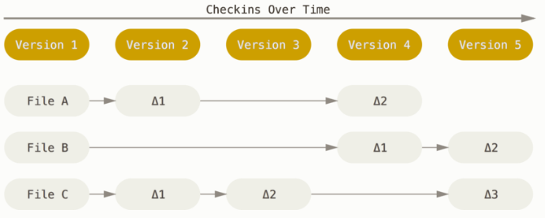
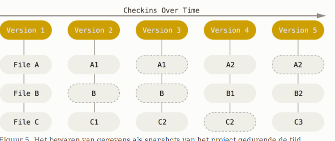
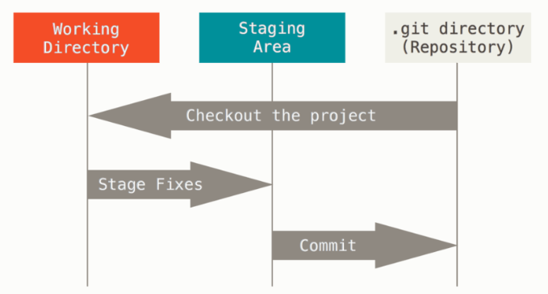

# What is Git?

Git is een plek om gegevens op te slaan, te delen en aan te passen.
Zelfs wanneer de gebruikersinterface van Git redelijk gelijk is aan die van andere CVSen, slaat GIT de gegevens anders op en kijkt heel anders naar informatie.

## Momentopnames, geen verschillen.

Conceptueel bewaren de meeste andere systemen informatie als een lijst van veranderingen per bestand. Deze systemen zien de informatie die ze bewaren als een groep bestanden.



Het bewaren van data als veranderingen aan een basisversie van elk bestand.
Git ziet en bewaard data heel anders. De kijk van Git op data kan beter worden uitgelegd als een reeks momentopnames van een miniatuur bestandssysteem.

Elke keer dat je commit word er als het ware een foto van de toestand van al je bestanden op dat moment genomen en word een verwijzing naar die foto opgeslagen. Git beschouwd gegevens meer als een reeks van snapshots.



Dit maakt Git meer een soort van mini bestandssysteem met een paar ongelooflijk krachtige gereedschappen.

## Bijna alle handelingen zijn lokaal.

Voor de meeste handelingen in GIT zijn alleen lokale bestanden nodig. Omdat de gehele geschiedenis van je project op je lokale harde schijf staat lijken de meeste acties geen tijd in beslag te nemen.

Omdat GIT niet bij een andere server bestanden hoeft op te halen, kun je gemakkelijk offline werken en je werk uploaden wanneer je weer online gaat. (bijv: werken in de trein zonder internet)

Als je veranderinge wilt zien tussen de huidige versie en die van een maand geleden, kan GIT gemakkelijk de oudere versie ophalen en vergelijken.

## GIT heeft integeriteit!

Alles in GIT krijgt een controle getal (checksum) voordat het word opgeslagen en er word later met dat controle getal naar gerefereerd. Zo is het onmogelijk een verandering door te voeren zonder dat GIT er van weet.

Het mechanisme dat GIT gebruikt heet een SHA-1-hash. Een teken reeks van 40 karakters lang bestaande uit hexadecimale tekens en word berekend uit de inhoud van een bestand of directory-structuur in GIT.

### Voorbeeld

```
24b9da6552252987aa493b52f8696cd6d3b00373
```

## Git voegt normaalgesproken alleen data toe

Bijna alles wat je in GIT doet leidt tot `toevoeging` van data in de GIT database. Zo is het moeilijk om het systeem iets te laten doen wat je niet ongedaan kunt maken of gegevens te laten wissen op wat voor manier dan ook. Zeker als je de lokale database regelmatig uploadt (met `Push`) naar een andere repository.

Het gebruik van GIT is plezierig omdat je kunt expirimenteren zonder jezelf ongelooflijk in de nesten te werken.

## De drie toestanden

Git heeft drei hoofdtoestanden waarin bestanden zich kunnen bevinden:

- Gecommit (committed) houd in dat alle data veilig is opgeslagen in je lokale database.
- Gewijzigd (modified) betekend dat je het bestand hebt gewijzigd maar nog niet hebt `gecommit`
- Voorbereid (staged) betekend dat je hebt aangegeven dat de huidige versie van het bestand moet worden meegenomen in de volgende `commit`

Dit brengt ons tot de 3 hoofdonderdelen van een GIT project:

- De GIT directory
- De werkdirectory (working tree)
- De wachtrij voor een commit (staging area)



De `GIT Directory` is waar GIT de metadata en de objectdatabase van je project opslaat. Dit is het belangrijkste deel van GIT, deze directory word gekopieerd wanneer je een repository kloont vanaf een andere computer.

De `Working tree` is een checkout van een bepaalde versie van het project. Deze bestanden worden uit de gecomprimeerde database in de GIT directory gehaald en op de harde schijf geplaatst waar ze gebruikt of bewerk kunnen worden.

De `Staging area` is een bestand dat zich normaal gesproken in je `Git directory` bevindt, waar informatie opgeslagen wordt over wat in de volgende commit meegaat. In GIT vaktaal word dit de `Index` genoemd.

De algemene workflow gaat ongeveer zo:

1. Je bewerkt je bestanden in je `Working tree`
2. Je staged een selectie van de wijzigingen die je in de volgende commit wilt hebben, dit voegt alleen de wijzigingen in de staging area toe.
3. Je maakt een commit, hierbij worden snapshots gemaakt van alle bestanden in de staging area en verzameld en deze worden voorgoed in je GIT directory bewaard.
